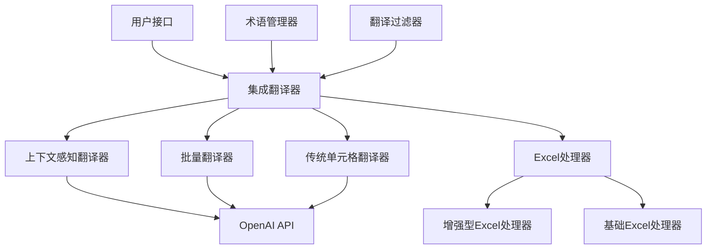

# Excel Translator


一个基于OpenAI的智能Excel翻译器，具有上下文感知功能和批量翻译能力，能够准确翻译Excel文件中的内容，同时保持原有的格式和结构。

## 目录

- [简介](#简介)
- [功能特性](#功能特性)
- [架构设计](#架构设计)
- [安装](#安装)
- [快速开始](#快速开始)
- [配置说明](#配置说明)
- [使用方法](#使用方法)
  - [命令行接口](#命令行接口)
  - [编程接口](#编程接口)
  - [Web API](#web-api)
- [项目结构](#项目结构)
- [常见问题解答](#常见问题解答)
- [路线图](#路线图)
- [贡献](#贡献)
- [许可证](#许可证)
- [支持](#支持)

## 简介

Excel Translator是一个强大的工具，专门用于翻译Excel电子表格中的内容。与传统的逐单元格翻译工具不同，Excel Translator利用先进的AI技术和上下文感知算法，能够理解表格的结构、列的含义以及数据之间的关系，从而提供更准确、更一致的翻译结果。

该工具特别适用于需要翻译技术文档、数据报告、产品规格表等复杂Excel文件的场景，能够确保专业术语的一致性，并保持原始文件的格式和布局。

## 功能特性

- **上下文感知翻译**：利用表格结构、列类型和专业领域信息进行智能翻译，确保翻译结果符合上下文语境
- **批量翻译**：支持将多行数据合并为单个翻译请求，显著提高翻译效率并减少API调用次数。具有以下高级特性：
  - **智能分批**：根据模型token限制智能分批处理大量数据，自动优化批次大小
  - **多Sheet支持**：支持翻译包含多个工作表的Excel文件，保持工作表间的引用关系
- **格式保留**：可选择保留原始Excel文件的格式，包括合并单元格、字体样式、边框等
- **术语管理**：内置专业领域术语库（机械、电气等），确保专业术语翻译的一致性
- **智能缓存**：内置缓存机制，避免重复翻译相同内容，提高处理效率
- **领域检测**：自动识别内容所属的专业领域（机械、电气、软件、医疗等），应用相应的翻译规则
- **OpenAI集成**：使用先进的AI模型（如GPT-4o）进行高质量翻译，支持多种语言
- **异步处理**：采用异步编程模型，提高处理效率和响应速度
- **错误处理**：完善的错误处理机制，确保在翻译失败时能够优雅地处理并提供有用的错误信息
- **Web API支持**：提供RESTful API接口，支持通过HTTP请求进行翻译

## 架构设计



## 安装

### 环境要求

- Python 3.11 或更高版本
- OpenAI API密钥

### 克隆项目

```bash
git clone https://github.com/your-username/excel-translator.git
cd excel-translator
```

### 安装依赖

推荐使用 [uv](https://github.com/astral-sh/uv) 来管理依赖：

```bash
# 安装 uv (如果尚未安装)
pip install uv

# 安装项目依赖
uv sync
```

或者使用 pip：

```bash
pip install -e .
```

## 快速开始

### 1. 配置环境

复制 `.env.example` 文件并重命名为 `.env`：

```bash
cp .env.example .env
```

编辑 `.env` 文件，填写必要的配置信息：

```bash
# OpenAI配置
OPENAI_API_KEY=your_openai_api_key_here
OPENAI_MODEL=gpt-4o
OPENAI_BASE_URL=https://api.openai.com/v1

# 翻译设置
MAX_BATCH_SIZE=50
REQUEST_TIMEOUT=30
PRESERVE_FORMAT=true
# 批量翻译设置
BATCH_TRANSLATION_ENABLED=true
MAX_TOKENS=4096
TOKEN_BUFFER=500

# 文件设置
UPLOAD_DIR=uploads
OUTPUT_DIR=output
MAX_FILE_SIZE=10485760

# 日志设置
LOG_LEVEL=INFO
```

### 2. 命令行使用

```bash
python main.py -i input.xlsx -o output -l english
```

### 3. 启动Web服务

```bash
python main.py
```

然后访问 `http://localhost:18000/docs` 查看API文档。

## 配置说明

### 配置参数说明

- `OPENAI_API_KEY`: 你的OpenAI API密钥（必需）
- `OPENAI_MODEL`: 使用的OpenAI模型，默认为 `gpt-4o`
- `OPENAI_BASE_URL`: OpenAI API的基础URL，可选，用于使用代理或自定义端点
- `MAX_BATCH_SIZE`: 批量翻译的最大单元数，默认为 `50`
- `REQUEST_TIMEOUT`: API请求超时时间（秒），默认为 `30`
- `PRESERVE_FORMAT`: 是否保留原始Excel格式，默认为 `true`
- `BATCH_TRANSLATION_ENABLED`: 是否启用批量翻译，默认为 `true`。启用后将使用上下文感知的批量翻译功能，显著提高翻译效率并减少API调用次数
- `MAX_TOKENS`: 最大输出token数量，默认为 `4096`。用于控制批量翻译中每个批次的最大token数量，避免超出模型限制
- `TOKEN_BUFFER`: token缓冲区大小，默认为 `1000`。为批量翻译中的格式化内容预留的token空间，确保不会因格式化内容超出token限制
- `UPLOAD_DIR`: 上传文件目录，默认为 `uploads`
- `OUTPUT_DIR`: 输出文件目录，默认为 `output`
- `MAX_FILE_SIZE`: 最大文件大小（字节），默认为 `10485760`（10MB）
- `LOG_LEVEL`: 日志级别，默认为 `INFO`

## 使用方法

### 编程接口

#### 基本用法

```python
import asyncio
from translator.integrated_translator import IntegratedTranslator

async def translate_excel():
    # 创建翻译器实例
    translator = IntegratedTranslator(
        model="gpt-4o",  # 指定模型
        use_context_aware=True,  # 使用上下文感知翻译
        preserve_format=True     # 保留原始格式
    )
    
    # 翻译Excel文件
    result_path = await translator.translate_excel_file(
        file_path="input.xlsx",
        output_path="output",
        source_language="chinese",
        target_language="english"
    )
    
    print(f"翻译完成，结果保存在: {result_path}")

# 运行异步函数
asyncio.run(translate_excel())
```

#### 批量翻译

Excel Translator默认启用批量翻译功能，可以显著提高翻译效率并减少API调用次数。批量翻译会智能地将多个文本单元组合成批次进行翻译，同时保持上下文信息。

```python
import asyncio
from translator.integrated_translator import IntegratedTranslator

async def translate_excel_with_batch():
    # 创建翻译器实例（默认启用批量翻译）
    translator = IntegratedTranslator(
        model="gpt-4o",  # 指定模型
        use_context_aware=True,      # 使用上下文感知翻译
        preserve_format=True,       # 保留原始格式
        batch_translation_enabled=True  # 启用批量翻译（默认值）
    )
    
    # 翻译Excel文件（将自动使用批量翻译）
    result_path = await translator.translate_excel_file(
        file_path="input.xlsx",
        output_path="output",
        source_language="chinese",
        target_language="english"
    )
    
    print(f"翻译完成，结果保存在: {result_path}")
    
    # 获取翻译统计信息
    stats = translator.get_translation_stats()
    print(f"翻译统计: {stats}")

# 运行异步函数
asyncio.run(translate_excel_with_batch())
```

### Web API

Excel Translator提供了一个基于FastAPI的Web API接口，可以通过HTTP请求进行翻译。

#### 启动服务

```bash
python main.py
```

服务将启动在 `http://localhost:18000`。

#### API端点

- `POST /api/v1/excel-translator/translate`: 翻译Excel文件
  - 参数：
    - `file`: 上传的Excel文件（multipart/form-data）
    - `source_language`: 源语言
    - `target_language`: 目标语言
    - `model`: 使用的模型
    - `domain_terms`: 领域术语字典（可选，JSON格式字符串）

#### API使用示例

使用curl命令：

```bash
curl -X POST "http://localhost:18000/api/v1/excel-translator/translate" \
  -H "accept: text/event-stream" \
  -H "Content-Type: multipart/form-data" \
  -F "file=@input.xlsx" \
  -F "source_language=chinese" \
  -F "target_language=english" \
  -F "model=gpt-4o"
```

## 项目结构

```
excel-translator/
├── main.py                 # 应用入口文件
├── pyproject.toml          # 项目配置文件
├── .env.example           # 环境变量示例文件
├── README.md              # 项目说明文档
├── LICENSE                # 许可证文件
├── design/                # 设计文档目录
│   ├── batch_translation_methods.md
│   └── batch_translator_design.md
├── src/                   # 源代码目录
│   ├── api/               # API相关代码
│   │   ├── routes.py      # API路由
│   │   └── sse_manager.py # SSE管理器
│   ├── config/            # 配置相关代码
│   │   ├── settings.py    # 应用配置
│   │   └── logging_config.py # 日志配置
│   ├── models/            # 数据模型
│   └── translator/        # 翻译核心代码
│       ├── integrated_translator.py      # 集成翻译器
│       ├── context_aware_translator.py   # 上下文感知翻译器
│       ├── context_aware_batch_translator.py # 批量翻译器
│       ├── excel_handler.py              # Excel处理器
│       ├── enhanced_excel_handler.py     # 增强型Excel处理器
│       ├── terminology_manager.py        # 术语管理器
│       ├── translation_filter.py         # 翻译过滤器
│       └── ...                           # 其他翻译相关模块
└── tests/                 # 测试代码目录
```

## 常见问题解答

### 1. 翻译速度慢怎么办？

- 启用批量翻译功能，可以显著提高翻译效率
- 检查网络连接是否稳定
- 确认OpenAI API密钥是否正确配置
- 调整`MAX_BATCH_SIZE`参数以优化性能

### 2. 翻译结果不准确怎么办？

- 确保使用了正确的上下文感知翻译功能
- 检查是否正确配置了领域术语
- 尝试使用不同的AI模型
- 确认源语言和目标语言设置是否正确

### 3. 格式丢失怎么办？

- 确认`PRESERVE_FORMAT`配置项是否设置为`true`
- 检查Excel文件是否包含复杂的格式设置
- 尝试使用增强型Excel处理器

### 4. API调用超限怎么办？

- 检查OpenAI API的使用配额
- 调整`REQUEST_TIMEOUT`参数增加超时时间
- 启用缓存功能避免重复翻译

### 5. 如何添加自定义术语？

可以通过以下方式添加自定义术语：
- 在代码中使用`TerminologyManager`类添加术语
- 通过API接口传递`domain_terms`参数
- 修改配置文件添加术语库

## 贡献

欢迎任何形式的贡献！如果你想为这个项目做贡献，请遵循以下步骤：

1. Fork 本仓库
2. 创建你的特性分支 (`git checkout -b feature/AmazingFeature`)
3. 提交你的更改 (`git commit -m 'Add some AmazingFeature'`)
4. 推送到分支 (`git push origin feature/AmazingFeature`)
5. 开启一个 Pull Request

### 开发环境设置

1. 克隆 Fork 的仓库
2. 安装依赖：`uv sync`

### 提交规范

请确保你的代码遵循项目的编码规范，并包含适当的测试。

## 许可证

本项目采用 MIT 许可证。详情请见 [LICENSE](LICENSE) 文件。

## 支持

如果你觉得这个项目对你有帮助，请考虑给它一个⭐️！

如果你有任何问题或建议，请提交 issue 或联系项目维护者。